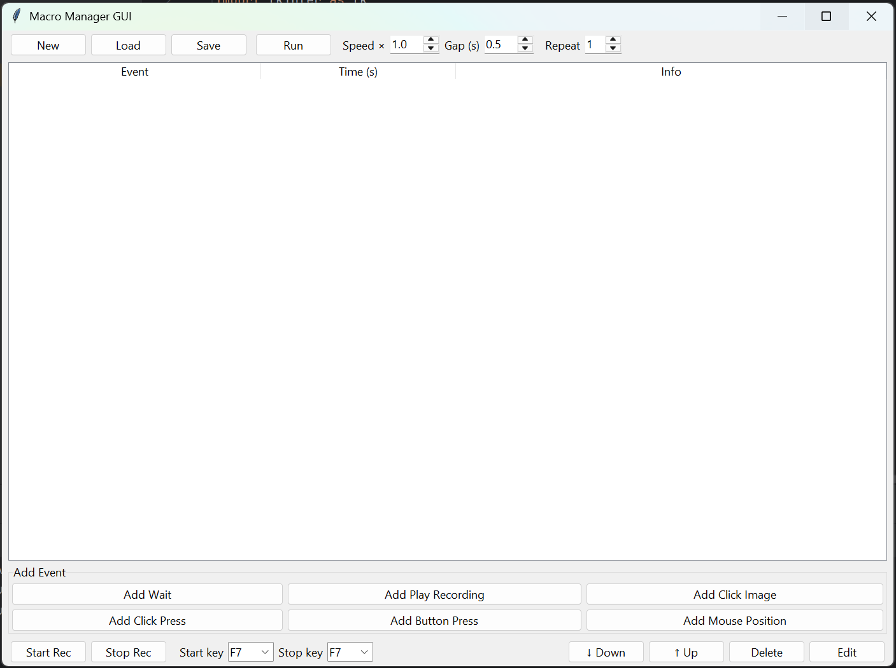

## 🖱️ Macro Recorder
A lightweight Python tool to **record and replay keyboard/mouse input**, plus build **higher‑level macros** with image detection and composed recordings — ideal for automation, testing, or demos.

### 📦 Features
- **Keyboard & mouse recording**: presses, releases, movement, clicks, and scroll
- **Accurate replay** of recorded JSON sessions
- **Typed event model** using Pydantic (`event.py`)
- **GUI macro builder** to chain recordings, waits, key presses, mouse positions, and image clicks
- **Image detection** (click on images on screen, with confidence and timeout)

### 💻 Requirements
- **OS**: Windows (uses `ctypes` DPI calls and `pydirectinput`)
- **Python**: `>= 3.12`
- **Dependencies** (managed via `uv`, see `pyproject.toml`):
  - `pynput`, `pydirectinput`, `pyautogui`, `pydantic`, `opencv-python`, `pillow`, `pyscreeze`

### 🚀 Setup (with `uv`)
Make sure `uv` is installed, then install dependencies:

```bash
curl -Ls https://astral.sh/uv/install.sh | sh
cd input-recorder
uv sync
```

### 🎥 Record Input (CLI)
Records mouse and keyboard events to `recording.json` by default.

```bash
uv run python recorder.py
```

Default behavior:
- Press **F7** to start recording
- Press **F7** again to stop and save `recording.json`

You can adjust start/stop keys programmatically by creating `EventRecorder` with different `start_recording_key` / `stop_recording_key` values.

### 🔁 Replay a Recording (CLI)
Replays a previously recorded JSON file.

```bash
uv run python player.py
```

Defaults:
- Reads from `recording.json` in the current directory
- Press **F7** to start playback, **F8** to stop
- Supports `speed_multiplier` on `EventPlayer` to slow down / speed up playback

To play a different file:

```python
from player import EventPlayer

player = EventPlayer(input_file_path="my_recording.json", speed_multiplier=1.5)
player.load_recording_file()
player.run()
```

### 🧩 GUI Macro Builder
Use the GUI to compose more complex macros from building blocks like waits, recordings, key presses, mouse positions, and image clicks.

```bash
uv run python gui.py
```



In the GUI you can:
- **Record** a new low‑level recording (configurable start/stop function keys)
- **Add steps**: Wait, Play Recording, Click Image, Key Press, Mouse Click, Mouse Position
- **Reorder / edit / delete** steps in a recipe
- **Set playback options**: overall speed, gap between non‑wait steps, and repeat count

Recipes are saved/loaded as JSON files that contain a list of typed events (`WaitEvent`, `RunRecordingEvent`, `ImageClickEvent`, `KeyPressEvent`, `MouseClickEvent`, `MousePositionEvent`, …).

### ⚠️ Notes & Tips
- On Windows with display scaling, the app tries to enable **per‑monitor DPI awareness** so recorded/replayed coordinates line up.
- Some games and anti‑cheat systems may block synthetic input; use responsibly.
